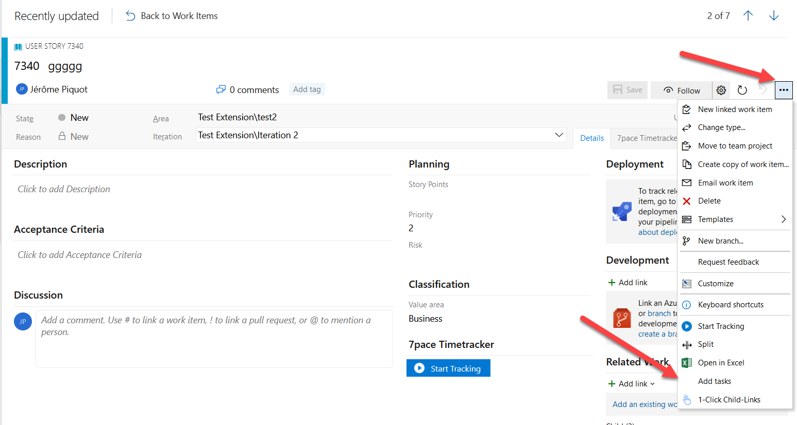
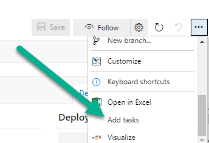

# Child Tasks Template for Azure Boards

[](https://marketplace.visualstudio.com/items?itemName=Fiveforty.ChildTasksTemplate)
[](https://marketplace.visualstudio.com/items?itemName=Fiveforty.ChildTasksTemplate)
[](https://marketplace.visualstudio.com/items?itemName=Fiveforty.ChildTasksTemplate)
[](LICENSE)

Stop re-typing the same tasks on every user story. **Child Tasks Template** lets you define reusable sets of child work items per project, then create them under any parent work item in one click — already linked, titled, estimated and placed in the right area and iteration.

**[Install from the Visual Studio Marketplace →](https://marketplace.visualstudio.com/items?itemName=Fiveforty.ChildTasksTemplate)**



---

## Contents

- [Features](#features)
- [Getting started](#getting-started)
- [Template reference](#template-reference)
- [Examples](#examples)
- [Upgrading from 2.x](#upgrading-from-2x)
- [Troubleshooting](#troubleshooting)
- [Permissions and data](#permissions-and-data)
- [Development](#development)
- [Support and license](#support-and-license)

---

## Features

- **One-click child creation** — an **Add tasks** action on the work item form, on board and backlog cards, and in query results.
- **Several templates at once** — tick one or more templates in the picker; every task of every selected template is created.
- **Parent values in children** — reuse any parent field in a child's title or fields: `{System.Title}`, `{System.IterationPath}`, `{System.AssignedTo.uniqueName}`, `{id}`…
- **Any work item type** — each entry in a template can be a Task, a Bug, or any other child type your process allows.
- **Visual template editor** — build templates with forms instead of hand-written JSON, with a JSON mode for power users.
- **Field suggestions from your project** — field names are auto-completed from the process of the selected work item type, with hints for drop-down values, dates and decimals.
- **Validation before save** — unknown fields, invalid drop-down values, bad dates and non-numeric estimates are caught in the editor, not when tasks are created.
- **Clear results** — after creation you see how many items were created, which ones failed and why.
- **Per-project configuration** — each project keeps its own set of templates.

---

## Getting started

### 1. Install the extension

Install **[Child Tasks Template](https://marketplace.visualstudio.com/items?itemName=Fiveforty.ChildTasksTemplate)** in your Azure DevOps organization (an organization administrator may need to approve the request).

### 2. Configure templates for a project

1. Open your project and go to **Project settings**.
2. In the **Extensions** section of the left menu, select **Child Tasks Template**.
3. The first time, a sample *Development* template (Design / Development / Testing) is loaded so you have something to start from.
4. Edit it in the **Visual** editor, or switch the toggle to **JSON** to paste a configuration.
5. Click **Save**.

In the visual editor you can:

| Action | What it does |
|---|---|
| **Add Template** | Adds an empty template. |
| **Add Template via JSON** | Paste a single template, or a full configuration, to import it. |
| **Add Task** | Adds a child work item to the template and lets you choose its work item type. |
| **Add Field** | Adds a field to set on that child. Start typing to get suggestions from your project. |

In JSON mode, **Copy JSON** puts the whole configuration on your clipboard — handy to copy templates from one project to another — and **Format** re-indents it.

### 3. Create child tasks

1. Open a parent work item (for example a User Story, a Product Backlog Item or a Bug), or right-click it on a board, backlog or query result.
2. Choose **Add tasks** from the `⋯` menu.

   

3. Select one or more templates and confirm.

The child work items are created with a **Parent** link to the work item you started from. A summary shows the created items and any that failed.

---

## Template reference

A configuration is a JSON document with a list of templates. Each template has a list of tasks, and each task has a list of fields.

```json
{
  "version": 3,
  "templates": [
    {
      "name": "Development",
      "tasks": [
        {
          "name": "Design - {System.Title}",
          "workItemType": "Task",
          "fields": [
            { "name": "System.AreaPath", "value": "{System.AreaPath}" },
            { "name": "System.IterationPath", "value": "{System.IterationPath}" },
            { "name": "Microsoft.VSTS.Common.Activity", "value": "Design" },
            { "name": "Microsoft.VSTS.Scheduling.OriginalEstimate", "value": "2" }
          ]
        }
      ]
    }
  ]
}
```

| Property | Required | Description |
|---|---|---|
| `version` | yes | Configuration format version. Use `3`. |
| `templates[].name` | yes | Name shown in the template picker. |
| `templates[].tasks[].name` | yes | Title of the created work item. Supports `{…}` placeholders. |
| `templates[].tasks[].workItemType` | no | Work item type to create. Defaults to `Task`. Must exist in the project's process. |
| `templates[].tasks[].fields[].name` | yes | Field **reference name**, for example `System.AreaPath` or `Microsoft.VSTS.Common.Activity`. |
| `templates[].tasks[].fields[].value` | no | Value to set. Supports `{…}` placeholders. Fields with an empty value are skipped. |

### Using parent values

Any text between braces is replaced with the value from the **parent** work item at creation time:

| Placeholder | Value |
|---|---|
| `{id}` | Parent ID |
| `{url}` | Parent REST URL |
| `{rev}` | Parent revision |
| `{System.Title}` | Parent title |
| `{System.AreaPath}` / `{System.IterationPath}` | Parent area / iteration |
| `{System.AssignedTo.uniqueName}` | Parent assignee's sign-in name (use it to assign the child to the same person) |
| `{System.AssignedTo.displayName}` | Parent assignee's display name |
| `{Custom.MyField}` | Any other field of the parent, including custom fields |

Placeholders can be mixed with text: `"[{id}] Code review - {System.Title}"`.

### Value rules

- **Title** — the task `name` becomes the child's `System.Title`. If you also add a `System.Title` field, the field wins.
- **Numbers** — both `1.5` and `1,5` are accepted; estimates such as `OriginalEstimate`, `RemainingWork` and `StoryPoints` are sent as numbers.
- **Drop-down fields** — the value must be one of the field's allowed values (for example `Design`, `Development`, `Testing` for Activity). The editor shows the allowed values.
- **Dates** — use an ISO date such as `2026-12-31`.
- **Duplicate fields** — if the same field appears twice in a task, the last value is used.
- Values containing placeholders are not validated in the editor, because their final value is only known at creation time.

---

## Examples

<details>
<summary><b>Scrum — same sprint and area as the story, assigned to the story owner</b></summary>

```json
{
  "version": 3,
  "templates": [
    {
      "name": "Story breakdown",
      "tasks": [
        {
          "name": "Analysis - {System.Title}",
          "fields": [
            { "name": "System.AreaPath", "value": "{System.AreaPath}" },
            { "name": "System.IterationPath", "value": "{System.IterationPath}" },
            { "name": "System.AssignedTo", "value": "{System.AssignedTo.uniqueName}" },
            { "name": "Microsoft.VSTS.Scheduling.RemainingWork", "value": "2" }
          ]
        },
        {
          "name": "Implementation - {System.Title}",
          "fields": [
            { "name": "System.AreaPath", "value": "{System.AreaPath}" },
            { "name": "System.IterationPath", "value": "{System.IterationPath}" },
            { "name": "System.AssignedTo", "value": "{System.AssignedTo.uniqueName}" },
            { "name": "Microsoft.VSTS.Scheduling.RemainingWork", "value": "6" }
          ]
        },
        {
          "name": "Code review - {System.Title}",
          "fields": [
            { "name": "System.AreaPath", "value": "{System.AreaPath}" },
            { "name": "System.IterationPath", "value": "{System.IterationPath}" },
            { "name": "Microsoft.VSTS.Scheduling.RemainingWork", "value": "1" }
          ]
        }
      ]
    }
  ]
}
```

</details>

<details>
<summary><b>Bug fix checklist with a description and tags</b></summary>

```json
{
  "version": 3,
  "templates": [
    {
      "name": "Bug fix",
      "tasks": [
        {
          "name": "Reproduce #{id}",
          "fields": [
            { "name": "System.IterationPath", "value": "{System.IterationPath}" },
            { "name": "System.Description", "value": "Reproduce bug #{id}: {System.Title}" },
            { "name": "System.Tags", "value": "bugfix" }
          ]
        },
        {
          "name": "Fix #{id}",
          "fields": [
            { "name": "System.IterationPath", "value": "{System.IterationPath}" },
            { "name": "System.Tags", "value": "bugfix" }
          ]
        },
        {
          "name": "Add regression test #{id}",
          "fields": [
            { "name": "System.IterationPath", "value": "{System.IterationPath}" },
            { "name": "System.Tags", "value": "bugfix; test" }
          ]
        }
      ]
    }
  ]
}
```

</details>

<details>
<summary><b>Agile — tasks with an Activity and an Original Estimate</b></summary>

```json
{
  "version": 3,
  "templates": [
    {
      "name": "Development",
      "tasks": [
        {
          "name": "Design",
          "workItemType": "Task",
          "fields": [
            { "name": "System.IterationPath", "value": "{System.IterationPath}" },
            { "name": "System.AreaPath", "value": "{System.AreaPath}" },
            { "name": "Microsoft.VSTS.Common.Activity", "value": "Design" },
            { "name": "Microsoft.VSTS.Scheduling.OriginalEstimate", "value": "2" }
          ]
        },
        {
          "name": "Development",
          "workItemType": "Task",
          "fields": [
            { "name": "System.IterationPath", "value": "{System.IterationPath}" },
            { "name": "System.AreaPath", "value": "{System.AreaPath}" },
            { "name": "Microsoft.VSTS.Common.Activity", "value": "Development" },
            { "name": "Microsoft.VSTS.Scheduling.OriginalEstimate", "value": "8" }
          ]
        },
        {
          "name": "Testing",
          "workItemType": "Task",
          "fields": [
            { "name": "System.IterationPath", "value": "{System.IterationPath}" },
            { "name": "System.AreaPath", "value": "{System.AreaPath}" },
            { "name": "Microsoft.VSTS.Common.Activity", "value": "Testing" },
            { "name": "Microsoft.VSTS.Scheduling.OriginalEstimate", "value": "4" }
          ]
        }
      ]
    }
  ]
}
```

</details>

To use one of these, open the settings page, click **Add Template via JSON** and paste it — or switch to **JSON** mode to replace the whole configuration.

---

## Upgrading from 2.x

Version 3 is a complete rewrite with a new editor. Upgrading is automatic:

- **Your templates are kept.** The first time a project's templates are loaded, the 2.x configuration is read, converted to the current format and saved under the new storage key. The 2.x data itself is not deleted.
- **Very old single-list configurations** (a `tasks` array without `templates`) are converted to one template named `default`.
- **Same menu entry, same permission** — the **Add tasks** action and the *Work items (read and write)* scope are unchanged, so no new consent is needed.

What changes for you:

- The JSON-only settings screen is replaced by the visual editor (JSON is still available through the toggle).
- `workItemType` lets a template create Bugs or other types, not only Tasks.
- Field values are now checked when you save, so a template that used to fail silently at creation time may now show an error in the editor. Fix the reported field and save again.

---

## Troubleshooting

**The `Add tasks` entry does not appear.**
Check that the extension is installed and enabled for the organization (*Organization settings → Extensions*). Refresh the browser page after installing.

**"Templates have not been defined" or the picker is empty.**
Open *Project settings → Child Tasks Template* and save at least one template. Templates are per project.

**A child was not created / "API request failed: 400".**
The message under the result shows the field Azure DevOps rejected. Common causes:
- the field reference name is misspelled or the field does not exist on that work item type;
- a drop-down value is not in the allowed list (values are case-sensitive in some processes);
- the area or iteration path does not exist in this project;
- the work item type cannot be a child of the parent in your process.

**Estimates were saved with the wrong value (for example 8 became 80).**
This was a 2.x issue with some browser locales, such as French. Version 3 stores values as text and only converts them to numbers when the work item is created, accepting both `1.5` and `1,5`.

**Some children were created and others failed.**
Successful items are kept. Fix the failing template entry and create only the missing items, or delete the partial set and run the template again.

---

## Permissions and data

- **Scope:** `vso.work_write` — read the parent work item and create child work items. The extension calls the Azure DevOps REST API with the signed-in user's identity, so it can only create what that user is allowed to create.
- **Storage:** templates are stored with the Azure DevOps [extension data service](https://learn.microsoft.com/azure/devops/extend/develop/data-storage), one document per project, inside your organization.
- **No external services:** the extension sends no data outside your Azure DevOps organization and contains no telemetry.
- **Supported platform:** Azure DevOps Services (`dev.azure.com`).

---

## Development

### Prerequisites

- Node.js 20+ and npm 10+
- [tfx-cli](https://github.com/microsoft/tfs-cli) (installed as a dev dependency) for packaging

### Commands

```bash
npm install             # install dependencies
npm run dev             # Vite dev server
npm test                # unit tests (Vitest, watch mode)
npm run test:coverage   # tests with coverage
npm run lint            # ESLint
npm run type-check      # TypeScript, no emit
npm run build           # type-check + production build into dist/
npm run package         # build + create the .vsix in bin/
```

### Project layout

```
src-modern/
├── extension/           # "Add tasks" action entry point
├── chooseTemplate/      # template picker dialog
├── settings/            # project settings hub (visual / JSON editor)
├── features/
│   ├── template-editor/     # editor components and Zustand store
│   ├── template-selector/   # picker components and hooks
│   └── task-creation/       # creation hook
├── core/
│   ├── models/          # Template, Task, Field types
│   ├── services/        # REST calls, template storage, field metadata
│   └── utils/           # interpolation, validation, settings upgrade, import
└── shared/hooks/        # Azure DevOps SDK hooks
doc/                     # images used by the Marketplace page and this README
vss-extension.json       # extension manifest (public listing)
content_details.md       # Marketplace overview page
```

Stack: React 18, TypeScript (strict), Vite, Zustand, TanStack Query, `azure-devops-ui`, `azure-devops-extension-sdk`, Vitest.

### Release channels

| Channel | Extension ID | Visibility | How it is published |
|---|---|---|---|
| Preview | `Fiveforty.ChildTasksTemplate-dev` | Private, shared with the `fiveforty` organization | Automatically on every push to `dev` ([publish-dev.yml](.github/workflows/publish-dev.yml)) |
| Public | `Fiveforty.ChildTasksTemplate` | Public | Manually with `tfx extension publish` using `vss-extension.json` |

The two channels are separate extensions with separate storage: templates saved in the preview are not visible in the public extension. Use **Copy JSON** / **Add Template via JSON** to move them.

To publish the public extension:

```bash
npm run build && node scripts/copy-docs.js
npx tfx extension publish --manifest-globs vss-extension.json \
  --auth-type pat --token <PAT with Marketplace (Publish) scope>
```

Bump `version` in both `package.json` and `vss-extension.json` before publishing.

### Contributing

Issues and pull requests are welcome. Please run `npm run lint`, `npm run type-check` and `npm test -- --run` before opening a pull request, and target the `dev` branch.

---

## Support and license

- **Questions and bugs:** [GitHub Issues](https://github.com/dbru540/ChildTasksTemplate/issues)
- **Email:** [dbru@fiveforty.fr](mailto:dbru@fiveforty.fr)
- **License:** [Apache 2.0](LICENSE)

Made by Fiveforty.
